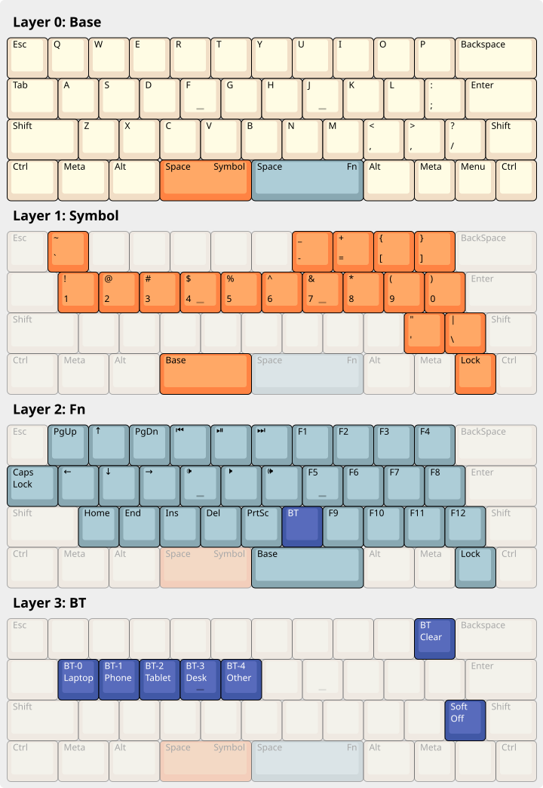

# tg4x

Firmware for my build of the [tg4x keyboard][tg4x GitHub]. Used with a
knockoff nice!nano2.

## Layout

I drew some inspiration from the advice in
[The Art of Making 40% keymaps that aren't crap][40% Not Crap].

Drawn using [Keyboard Layout Editor NG][KLE NG].

[tg4x GitHub]: <https://github.com/MythosMann/tg4x> "GitHub: tg4x"
[KLE NG]: <https://editor.keyboard-tools.xyz/> "Keyboard Layout Editor NG"
[40% Not Crap]: <https://www.keyboard-layout-editor.com/#/gists/016b11b6fc11fa1cb9306338a26e71f9> "The Art of Making 40% keymaps that aren't crap."
